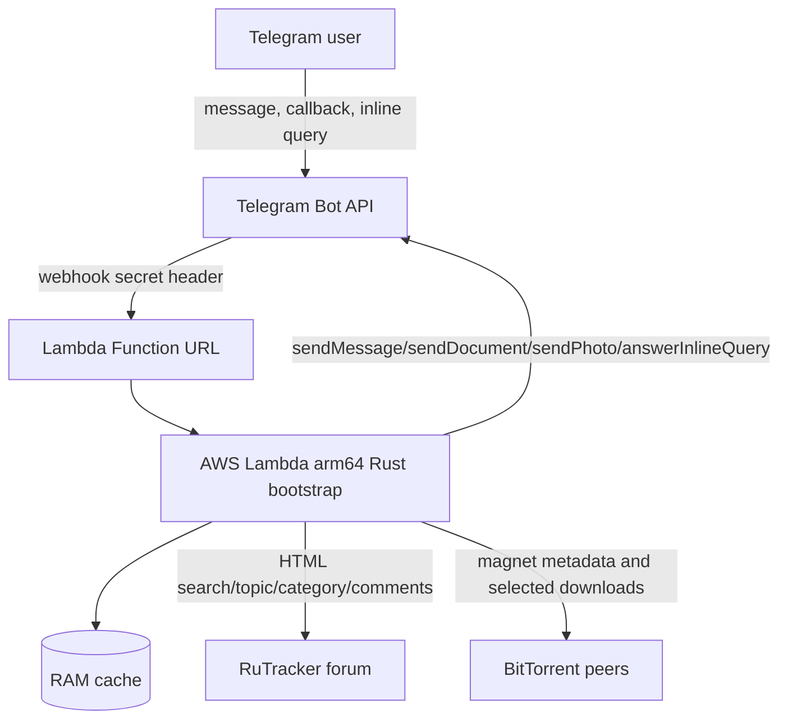

# Telegram RuTracker Bot

Rust Telegram bot for AWS Lambda ARM. It searches RuTracker topic titles, sends topic cards with category links, magnet links, file lists, descriptions, and downloads files that fit Telegram Bot API limits.

This codebase was generated by Codex GPT-5.5 xhigh.

The bot uses RuTracker HTML as the primary data source because the public pages expose the details needed for this workflow. The official RuTracker API v1 is useful for hashes, peer stats, and topic data, but it does not replace HTML parsing for search pages, first-post description/images/file lists, category browsing, and comments.

## Features

- Telegram webhook and inline mode.
- Search RuTracker titles and optionally rerun the query inside a selected category.
- `c text` category search with subcategory buttons and 10 latest posts.
- Per-result buttons: `Download`, `Description`, `Files`, `Magnet`, and category search.
- `Download` asks for `All under 50 MB` or `Select`; selection uses paged toggle buttons backed by RAM cache.
- If RuTracker is unavailable from Lambda, the bot returns the official news channel link: `@rutracker_news`.
- Description includes first-post images where Telegram can fetch them.
- Files are parsed from the first post when available, with torrent magnet metadata fallback.
- Files over 50 MB are formatted with strikethrough because Telegram does not provide gray text in messages.
- Download sends only files smaller than Telegram Bot API `sendDocument` 50 MB upload limit: https://core.telegram.org/bots/api#senddocument
- Torrent downloads use `librqbit`, the rqbit torrent client library: https://github.com/ikatson/rqbit
- Download sends each selected file immediately after that file is verified complete, while the torrent continues downloading the rest.
- Download status keeps chat action alive and updates remaining minutes until Lambda's 900 second, 15 minute maximum timeout: https://docs.aws.amazon.com/lambda/latest/dg/configuration-timeout.html
- When Lambda has only the final 10 seconds left, the bot stops waiting and reports how many files were downloaded and sent.
- Comments after download are paged with `Next` and page markers like `1/6`.
- Warm Lambda invocations use RAM caches for searches, topic pages, categories, latest posts, magnet metadata, and callback query text.

## Architecture



## Build

Lambda `arm64` currently maps to AWS Graviton2, whose core is Neoverse N1. The build config and script use `-C target-cpu=neoverse-n1` and produce an arm64 Lambda ZIP.

```bash
./scripts/build-lambda.sh
```

The build script uses `cargo-lambda`. If `rustup`, the ARM64 Rust target, or `cargo-lambda` are missing, it installs the missing Rust tooling into the project-local ignored `.tools/` directory.

Output:

```text
build/lambda.zip
```

## Deploy

```bash
cd infra
cp terraform.tfvars.example terraform.tfvars
$EDITOR terraform.tfvars
terraform init
terraform apply
cd ..
TELEGRAM_BOT_TOKEN=... TELEGRAM_WEBHOOK_SECRET=... ./scripts/set-webhook.sh
```

Terraform defaults to `eu-north-1`, avoiding Germany by default because RuTracker connectivity from Germany can be unreliable due to blocking.

The Lambda is configured for the maximum resources accepted by this AWS account and region:

- `arm64`
- `provided.al2023`
- 3,008 MB memory by default, configurable with `lambda_memory_size` if your account supports more
- 900 second timeout
- 10,240 MB `/tmp`

## Configuration

Environment variables:

- `TELEGRAM_BOT_TOKEN`
- `TELEGRAM_WEBHOOK_SECRET`
- `ALLOWED_TELEGRAM_USER_IDS`, comma-separated; empty means public
- `RUTRACKER_BASE_URLS`, comma-separated forum base URLs tried in order; default `https://rutracker.org/forum,https://rutracker.net/forum,https://rutracker.nl/forum`
- `RUTRACKER_BASE_URL`, backward-compatible single URL fallback when `RUTRACKER_BASE_URLS` is not set
- `RUTRACKER_USERNAME` and `RUTRACKER_PASSWORD`, optional authenticated search credentials
- `RUTRACKER_COOKIE`, optional fallback; credentials are preferred
- `SEARCH_LIMIT`, default `10`
- `MAX_FILE_MB`, default `50`
- `LAMBDA_TIMEOUT_SECONDS`, default `900`
- `DOWNLOAD_MARGIN_SECONDS`, default `20`
- `TORRENT_PEER_LIMIT`, default `120`
- `TMP_DIR`, default `/tmp`

## Logs

```bash
AWS_REGION=eu-north-1 PROJECT_NAME=telegram-rutracker-bot ./scripts/show-logs.sh
```

Set `SINCE=15m` to read a shorter window.

## Release

Patch version:

```bash
./scripts/release.sh "Release 0.0.2"
```

Middle version:

```bash
./scripts/release.sh --middle "Release 0.1.0"
```

The script updates `Cargo.toml`, regenerates `Cargo.lock`, commits, tags `X.Y.Z`, pushes the branch, and pushes the tag.

## Tests

```bash
cargo test
```

Tests include mock RuTracker HTML fixtures for search results, topic metadata, first-post files/images, comments page counts, and category parsing.
