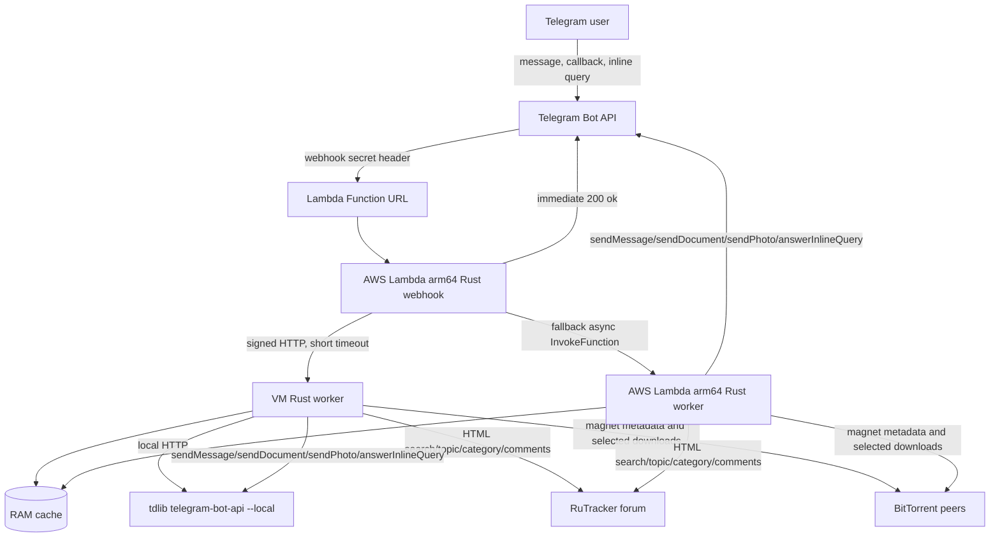

# Telegram RuTracker Bot, unofficial

[](https://sonarcloud.io/project/overview?id=vitaly-zdanevich_bot_telegram_rutracker)
[](https://sonarcloud.io/project/overview?id=vitaly-zdanevich_bot_telegram_rutracker)
[](https://sonarcloud.io/project/overview?id=vitaly-zdanevich_bot_telegram_rutracker)
[](https://sonarcloud.io/project/overview?id=vitaly-zdanevich_bot_telegram_rutracker)
[](https://sonarcloud.io/project/overview?id=vitaly-zdanevich_bot_telegram_rutracker)
[](https://sonarcloud.io/project/overview?id=vitaly-zdanevich_bot_telegram_rutracker)

Rust Telegram bot for AWS Lambda ARM and Oracle ARM VMs. It searches RuTracker topic titles, sends topic cards with category links, magnet links, file lists, descriptions, and downloads files that fit the configured Telegram Bot API upload limit.

This codebase was generated by Codex GPT-5.5 xhigh.

The bot uses RuTracker HTML as the primary data source because the public pages expose the details needed for this workflow. The official RuTracker API v1 is useful for hashes, peer stats, and topic data, but it does not replace HTML parsing for search pages, first-post description/images/file lists, category browsing, and comments.

RuTracker is used here as a culture-preservation platform. It hosts legal author releases, public domain and Creative Commons material, and abandoned works that are difficult or impossible to buy legally. It also contains pirated material; users are responsible for what they access. This README includes only service and configuration URLs, not links to specific torrent topics.

Please seed legal torrents when you can; it helps the ecosystem. Respect creators, and consider supporting your favorite artists and authors with money or by buying from them. If you know an indie artist, consider asking whether they want to release some work under Creative Commons and publish it legally on RuTracker, so more people can discover them.

## Features

- Telegram webhook, long-polling, and inline mode.
- Search RuTracker titles and optionally rerun the query inside a selected category.
- `c text` category search with subcategory buttons and 10 latest posts.
- Per-result buttons: `Description`, `Comments`, `Files`, `Download`, `Magnet`, and category search.
- `Download` asks for `All` or `All under <configured limit>` when a known file is too large, plus `Select`; selection uses paged toggle buttons backed by RAM cache.
- If RuTracker is unavailable from the active backend, the bot returns the official news channel link: `@rutracker_news`.
- Description includes first-post images where Telegram or the bot backend can fetch them.
- Files are parsed from the first post when available, with torrent magnet metadata fallback.
- Files over the configured upload limit are formatted with strikethrough because Telegram does not provide gray text in messages.
- Lambda uses the public Telegram Bot API `sendDocument` 50 MB upload limit by default: https://core.telegram.org/bots/api#senddocument
- The Telegram API endpoint is configurable, so a VM deployment can point the bot at tdlib's local `telegram-bot-api` server: https://github.com/tdlib/telegram-bot-api
- Torrent downloads use `librqbit`, the rqbit torrent client library: https://github.com/ikatson/rqbit
- Download sends each selected file immediately after that file is verified complete, while the torrent continues downloading the rest.
- VM deployments can keep a persistent `librqbit` session for seeding downloaded torrent data. The VM evicts old seeded torrents only when the next selected download plus the configured disk reserve would not fit.
- Download status keeps chat action alive and updates `AWS Lambda lifetime: N minutes left` until Lambda's 900 second, 15 minute maximum timeout: https://docs.aws.amazon.com/lambda/latest/dg/configuration-timeout.html
- VM deployments can set hourly download status updates with `DOWNLOAD_STATUS_INTERVAL_SECONDS=3600`.
- When Lambda has only the final 10 seconds left, the bot stops waiting and reports how many files were downloaded and sent.
- Comments are loaded explicitly with `Comments` and paged with `Next` and page markers like `1/6`.
- The public webhook Lambda tries a signed VM worker first, then falls back to a private worker Lambda when the VM is unavailable.
- The VM worker runs beside tdlib's local `telegram-bot-api` server for 2 GB uploads instead of the public Bot API's 50 MB limit.
- VM-only deployments can run the long-polling binary instead of the signed VM worker.
- Warm Lambda and VM worker processes use RAM caches for searches, topic pages, categories, latest posts, magnet metadata, Telegram update IDs, and callback query text. Caches are per process and are cleared on restart or deploy.

## Architecture



The production topology uses two Lambdas and one VM:

- `telegram-rutracker-bot` is the public webhook Lambda. It validates Telegram updates, quickly returns `200 OK`, and dispatches work to the VM over signed HTTP.
- `telegram-rutracker-bot-worker` is the private fallback Lambda. The webhook invokes it asynchronously when the VM is unavailable, so the bot can still answer from AWS without blocking Telegram's webhook request.
- The VM worker is the preferred backend. It has persistent disk for seeding, runs tdlib's local `telegram-bot-api --local` for 2 GB uploads instead of Lambda's 50 MB public Bot API limit, keeps torrent state between requests, and is not constrained by Lambda's 15 minute execution limit.

This split gives the VM a 2 GB local upload path through tdlib instead of the public Bot API's 50 MB limit, while the webhook Lambda stays fast and Lambda worker remains a free emergency fallback. Persistent storage, incoming torrent ports, and seeding are additional VM benefits.

VM-only long-polling mode uses the same app handler and in-process RAM caches, but reads updates through `getUpdates` and sends files through `TELEGRAM_API_BASE_URL`, usually a local tdlib `telegram-bot-api --local` server.

## Build

Lambda `arm64` currently maps to AWS Graviton2, whose core is Neoverse N1. The build config and script use `-C target-cpu=neoverse-n1` and produce arm64 Lambda ZIPs for both webhook and worker.

```bash
./scripts/build-lambda.sh
```

The build script uses `cargo-lambda`. If `rustup`, the ARM64 Rust target, or `cargo-lambda` are missing, it installs the missing Rust tooling into the project-local ignored `.tools/` directory.

Output:

```text
build/lambda.zip
build/worker.zip
```

Oracle VM poller binary:

```bash
./scripts/build-oracle.sh
```

Output:

```text
build/oracle/telegram-rutracker-vm-worker
build/oracle/telegram-rutracker-poller
```

## Local Checks

Run the same checks as CI:

```bash
./scripts/check.sh
```

Enable the tracked pre-commit hook for this clone:

```bash
git config core.hooksPath .githooks
```

## Deploy

Lambda:

```bash
cd infra
cp terraform.tfvars.example terraform.tfvars
$EDITOR terraform.tfvars
terraform init
terraform apply
cd ..
TELEGRAM_BOT_TOKEN=... TELEGRAM_WEBHOOK_SECRET=... ./scripts/set-webhook.sh
```

Terraform defaults to `eu-north-1`, avoiding Germany by default because RuTracker connectivity from Germany can be unreliable due to blocking.

The Lambda is configured for the maximum resources accepted by this AWS account and region:

- `arm64`
- `provided.al2023`
- 3,008 MB memory by default, configurable with `lambda_memory_size` if your account supports more
- webhook Lambda timeout: 30 seconds
- worker Lambda timeout: 900 seconds
- worker Lambda `/tmp`: 10,240 MB

Oracle VM:

```bash
cd infra/oracle
cp terraform.tfvars.example terraform.tfvars
$EDITOR terraform.tfvars
terraform init
terraform apply
```

The Oracle stack auto-selects the latest matching Ubuntu ARM image unless `oracle_image_ocid` is set explicitly. It provisions `VM.Standard.A1.Flex` with 4 OCPUs, 24 GB RAM, and a 200 GB boot volume by default, then builds tdlib `telegram-bot-api` and this bot on the VM.

For automatic fallback mode, deploy Oracle first, then copy the Oracle `vm_worker_url` output into the Lambda stack's `vm_worker_url`, using the same `vm_worker_secret` in both stacks. Telegram webhook still points to Lambda; Lambda dispatches to the VM first and falls back to the Lambda worker if the VM is unavailable.

For Oracle VM mode, the VM runs tdlib's `telegram-bot-api` with `--local`, sets `TELEGRAM_API_BASE_URL` to its local HTTP URL, and sets `MAX_FILE_MB=2000`. The VM builds the Rust binaries natively on ARM with `RUSTFLAGS="-C target-cpu=neoverse-n1"`. tdlib documents local-mode uploads up to 2000 MB: https://github.com/tdlib/telegram-bot-api

Oracle VM mode also sets `SEED_TORRENTS=true` by default, opens `torrent_listen_port` for TCP and UDP peer traffic, and keeps seeded data under the bot `TMP_DIR`. The bot already knows the selected download size before adding a torrent; set `seed_disk_reserve_mb` only if you want extra free disk space beyond that.

Oracle VM mode enables a local fallback catalog by default. A monthly systemd timer checks RuTracker's current unofficial XML dump topic, skips the run when the saved SQLite source info-hash or topic date is unchanged, otherwise downloads the dump with the Rust torrent client and rebuilds a local SQLite FTS index. The bot searches that index only after live RuTracker search fails all retries. The fallback does not include live comments.

Oracle VM mode can also host cached first-post spoiler images for Telegram rich Description messages. Set `image_cache_public_base_url` to the Lambda Function URL such as `https://example.lambda-url.eu-north-1.on.aws`; Lambda proxies `/image-cache/...` to the VM cache over `VM_WORKER_URL`, while the worker stores images under `image_cache_dir`. This avoids giving Telegram original image-host URLs directly: those hosts can reject Telegram fetches through hotlink checks, redirects, placeholders, TLS quirks, or rate limits even when the same URL works in a browser. The cache gives Telegram a stable AWS HTTPS URL with verified image bytes and plain image response headers. The Oracle firewall also redirects public port 80 to the worker on 8080 for direct cache diagnostics.

For VM-only mode without Lambda, stop `telegram-rutracker-vm-worker.service` and enable `telegram-rutracker-poller.service`. The poller calls `deleteWebhook` before using `getUpdates`.

Telegram delivery mode matters: a bot cannot reliably use webhook delivery and long polling at the same time. The poller calls `deleteWebhook` before `getUpdates`. To move a bot to a local Bot API server, tdlib documents using `logOut` from the public server first: https://github.com/tdlib/telegram-bot-api

Generic VM deployments need the same pieces as Oracle: tdlib `telegram-bot-api --local`, one of the Rust VM binaries, the environment variables below, and a process manager such as systemd. Oracle Terraform is only one ready-made recipe.

## Configuration

Environment variables:

- `TELEGRAM_BOT_TOKEN`
- `TELEGRAM_API_BASE_URL`, default `https://api.telegram.org`; set this to a self-hosted `telegram-bot-api` server such as `http://127.0.0.1:8081` when the bot runs beside tdlib's local Bot API server
- `TELEGRAM_WEBHOOK_SECRET`
- `WORKER_FUNCTION_NAME`, set by Terraform for the webhook Lambda
- `VM_WORKER_URL`, optional signed VM worker endpoint used by the webhook Lambda before Lambda fallback
- `VM_WORKER_SECRET`, HMAC secret shared by the webhook Lambda and VM worker
- `VM_WORKER_TIMEOUT_MS`, default `1500`
- `VM_WORKER_BIND`, default `127.0.0.1:8080`, used by `telegram-rutracker-vm-worker`
- `IMAGE_CACHE_PUBLIC_BASE_URL`, optional public VM worker base URL for cached rich Description images
- `IMAGE_CACHE_DIR`, default `$TMP_DIR/image-cache`, stores cached rich Description images
- `ALLOWED_TELEGRAM_USER_IDS`, comma-separated; empty means public
- `RUTRACKER_BASE_URLS`, comma-separated forum base URLs tried in order; default `https://rutracker.org/forum,https://rutracker.net/forum,https://rutracker.nl/forum`
- `RUTRACKER_BASE_URL`, backward-compatible single URL fallback when `RUTRACKER_BASE_URLS` is not set
- `RUTRACKER_USERNAME` and `RUTRACKER_PASSWORD`, optional authenticated search credentials
- `RUTRACKER_COOKIE`, optional fallback; credentials are preferred
- `SEARCH_LIMIT`, default `10`
- `RUTRACKER_HTTP_MAX_ATTEMPTS`, default `10`
- `MAX_FILE_MB`, default `50`
- `LAMBDA_TIMEOUT_SECONDS`, default `900`
- `DOWNLOAD_MARGIN_SECONDS`, default `20`
- `DOWNLOAD_COUNTDOWN_LABEL`, default `AWS Lambda lifetime`; Oracle VM deployments can use `Download time budget`
- `DOWNLOAD_STATUS_INTERVAL_SECONDS`, default `60`; Oracle VM Terraform sets `3600`
- `TORRENT_PEER_LIMIT`, default `120`
- `SEED_TORRENTS`, default `false`; Oracle VM Terraform sets `true`
- `TORRENT_LISTEN_PORT`, default `49152`, used for incoming TCP and uTP peer connections when seeding is enabled
- `SEED_DISK_RESERVE_MB`, default `0`, optional extra free disk space kept after fitting a new seeded torrent
- `RUTRACKER_CATALOG_ENABLED`, default `false`; Oracle VM Terraform sets `true`
- `RUTRACKER_CATALOG_PATH`, default `/var/lib/telegram-rutracker-bot/catalog/rutracker.sqlite` when catalog fallback is enabled
- `RUTRACKER_CATALOG_XML_TOPIC_ID`, default `5591249`, the current unofficial XML dump topic: https://rutracker.org/forum/viewtopic.php?t=5591249
- `RUTRACKER_CATALOG_DOWNLOAD_TIMEOUT_SECONDS`, default `43200` in Oracle Terraform
- `TMP_DIR`, default `/tmp`

## Logs

```bash
AWS_REGION=eu-north-1 PROJECT_NAME=telegram-rutracker-bot ./scripts/show-logs.sh
AWS_REGION=eu-north-1 FUNCTION_NAME=telegram-rutracker-bot-worker ./scripts/show-logs.sh
```

Set `SINCE=15m` to read a shorter window.

## Release

Patch version:

```bash
./scripts/release.sh "Release 0.0.2"
```

Middle version:

```bash
./scripts/release.sh --middle "Release 0.1.0"
```

The script updates `Cargo.toml`, regenerates `Cargo.lock`, commits, tags `X.Y.Z`, pushes the branch, and pushes the tag.

## Tests

```bash
cargo test
```

Tests include mock RuTracker HTML fixtures for search results, topic metadata, first-post files/images, comments page counts, and category parsing.
